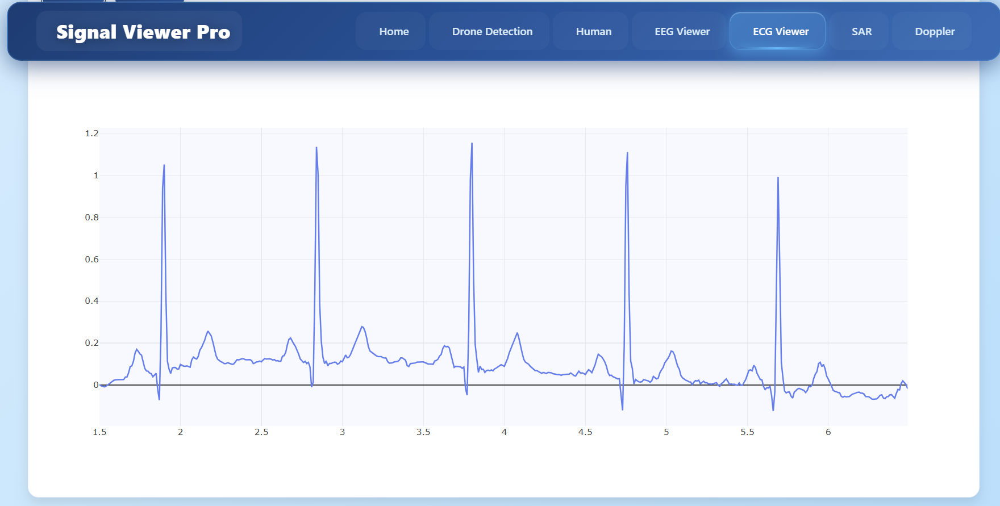
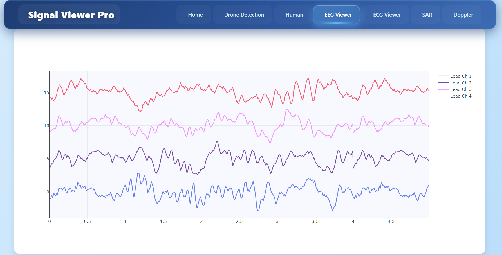
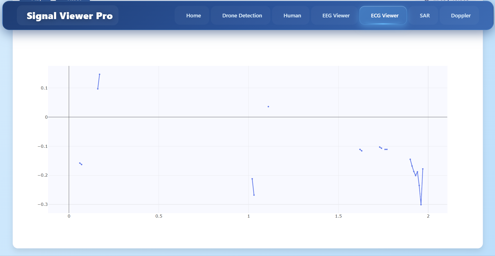
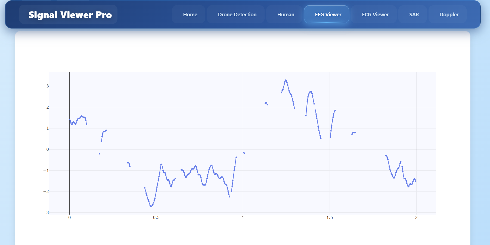
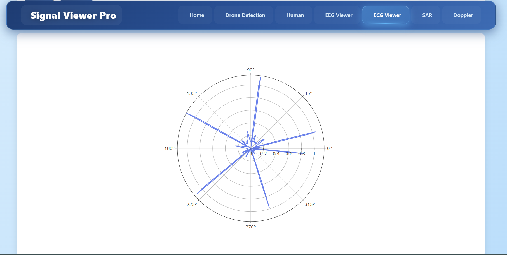
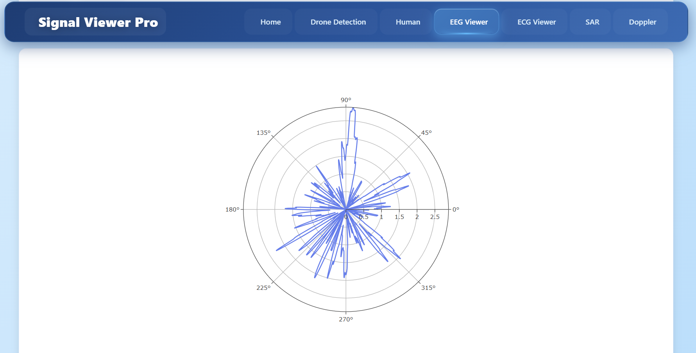
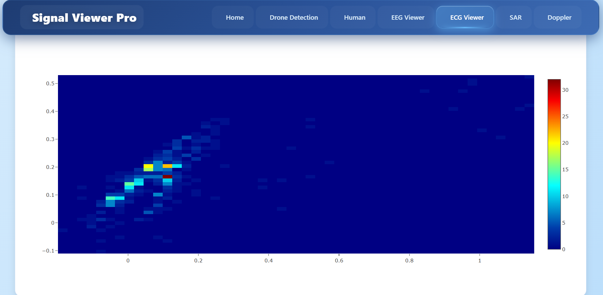
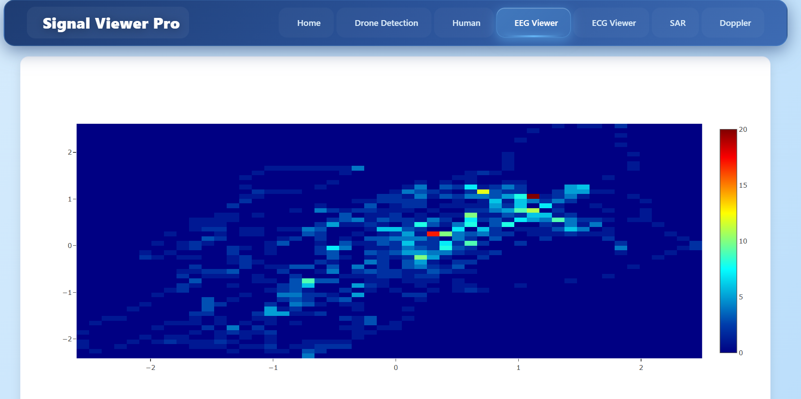

# 🩺 Signal Viewer pro


---

##  Overview

**Signal Viewer** is an interactive multi-signal visualization and analysis platform designed for **medical**, **acoustic**, and **radiofrequency (RF)** signal exploration.  
It combines **AI-driven abnormality detection**, advanced **multi-view visualization modes**, **sampling control**, and **real-time interactivity** — all in one professional tool.

---

## 🧠 Features

<details>
<summary> Medical Signals Viewer (ECG / EEG)</summary>

### 🔍 Key Features:
- **Multi-Channel Visualization** (supports ECG or EEG datasets)
 
- **Dynamic Viewing Modes:**
  1.  **Continuous-Time Viewer**  
     Default scrolling signal window with zoom, pan, and speed control  
     | ECG Viewer | EEG Viewer |
     |-------------|------------|
     |  |  |


  2.  **XOR Graph Viewer**  
     Visualizes differences between time chunks using XOR overlay  
     | ECG Viewer | EEG Viewer |
     |-------------|------------|
     |  |  |

  3.  **Polar Graph Viewer**  
     Maps signal magnitude vs. time in polar coordinates  
     | ECG Viewer | EEG Viewer |
     |-------------|------------|
     |  |  |

  4.  **Recurrence Graph Viewer**  
     Plots pairwise correlations between two channels  
     | ECG Viewer | EEG Viewer |
     |-------------|------------|
     |  |  |

### 🎚️  Sampling Frequency Slider & Aliasing Demonstration

A **sampling frequency slider** has been added to allow users to interactively adjust the sampling rate of medical signals.  
This feature demonstrates **under-sampling** and **aliasing effects** — showing how signal degradation affects the **AI abnormality classification output**.

#### Key Points:
- Adjust sampling frequency in real time  
- Observe waveform distortion and aliasing   
- Compare original vs. under-sampled signal  


</details>

---

<details>
<summary>🔊 Acoustic Signals Viewer (Doppler & Voice Analysis)</summary>

### 🚗 Vehicle-Passing Doppler Effect:
- Generate the **expected sound** of a car passing with velocity `v` and horn frequency `f`
- Real-time **adjustable controls** for `v` and `f`
- Load real Doppler sound recordings and use AI to **estimate velocity and frequency**


### 🚁 Drone Detection:
- Analyze audio signals to **detect drone presence**


---

###  Sampling Frequency Control & Aliasing

A **sampling frequency slider** has also been integrated into the **acoustic signal viewer**.  
This allows users to explore **under-sampling** and **aliasing** effects on sound signals, including **voice and Doppler** data.

#### 🧩 Features:
- Control and visualize different sampling frequencies  
- Instantly hear the **aliasing artifacts** introduced by low sampling rates  
- Observe the **impact on AI estimation** (classification)  

---

### 🗣️ Human Voice Under-Sampling & Anti-Alias Recovery

New functionality allows users to **open an arbitrary human voice file** and analyze how **under-sampling distorts** the audio.  
Then, the system employs an **anti-aliasing algorithm/model** to **restore the original voice**.

#### 🧩 Process:
1. Load a `.wav` or `.mp3` voice file  
2. Reduce its sampling rate using the slider  
3. Observe waveform and playback — aliasing introduces distortion  
4. Apply the **anti-alias model** to recover clarity and restore natural voice quality  
5. Compare “Before” and “After” both visually and audibly  

 


---

</details>

---

<details>
<summary>📡 Radiofrequency (RF) Signals Viewer (SAR Analysis)</summary>

### SAR Signal Analysis:
- Import and visualize **RF/SAR waveforms**
- Estimate physical parameters such as:
  - Target distance  
  - Power  
  - Phase shift  
- Supports both **time-domain** and **spectrum-domain** visualization  


</details>

---


## 🧰 Tech Stack

| Component | Technology |
|------------|-------------|
| **Frontend** | React + TailwindCSS + Plotly.js |
| **Backend / Processing** | Python (FastAPI / Flask) |
| **Signal Processing** | NumPy, SciPy, PyWavelets |
| **AI / ML** | TensorFlow / PyTorch |
| **Visualization** | Plotly, Matplotlib, Dash, React-Plotly |
| **Audio Handling** | librosa, sounddevice, scipy.signal |
| **Data Formats** | EDF, WAV, CSV, MAT |

---

## ⚙️ Installation

```bash
# Clone the repository
git clone https://github.com/your-username/signal-viewer.git
cd signal-viewer

# Backend setup
cd backend
pip install -r requirements.txt

# Frontend setup
cd ../frontend
npm install
npm run dev
